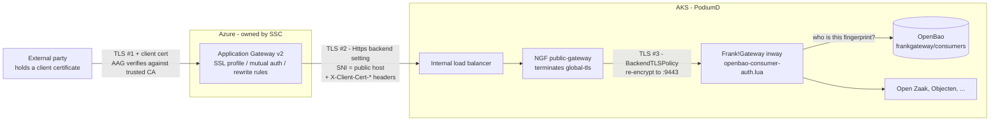
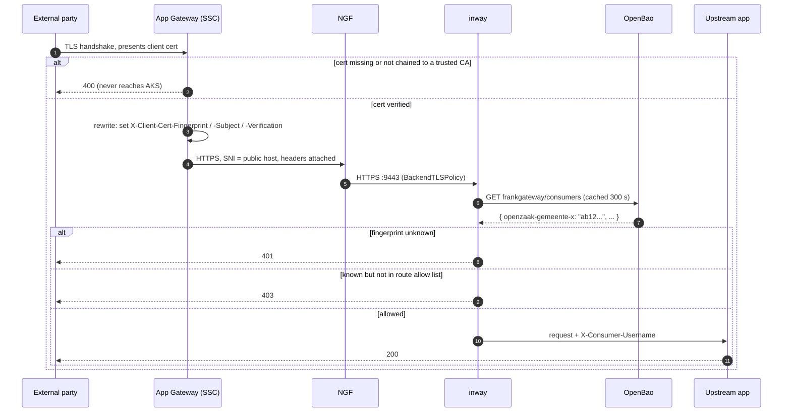
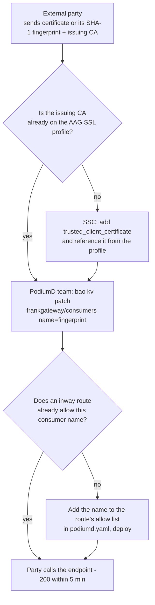

# Frank!Gateway — client certificates through the Azure Application Gateway

Design note for the hosting partner (SSC-Hosting) and the PodiumD team. How
externally presented client certificates reach the inway when an Azure
Application Gateway (AAG) fronts the environment, what the AAG can and cannot
do, and what the configuration looks like on both sides. Nothing in this note
changes the chart; the inway side is implemented and described in
[`frankgateway-routes.md`](frankgateway-routes.md#consumer-identities-from-openbao-inbound).

| | |
|---|---|
| Status | Informational — the AAG legs are configured by the hosting partner |
| Date | 2026-09-08 |
| Tracked in | IN-2658 |
| Applies to | inway class only (`frankgateway.instances.inway`) |

## Short answer

The Application Gateway **cannot pass TLS through**. It is a terminating proxy
by design (Azure Load Balancer is the pass-through product), so "pass-through
without SSL termination" is not an option to choose or to reject. It does not
need to be.

The working shape: the AAG **verifies** the client certificate, re-encrypts to
NGINX Gateway Fabric (NGF) exactly as it does today, and forwards the
certificate's identity as request headers. The inway authorises that identity
against a consumer list held in OpenBao. Nothing on the AKS side changes
topology.

## What SSC needs to do on the Application Gateway

Everything below is configuration on the existing AAG. No new resource, no
topology change, no pass-through mode. Four additions on the listener that
serves the inway hosts, one thing to confirm, and one joint check before the
first consumer is onboarded.

### Checklist

| # | Action | Detail | Why |
|---|---|---|---|
| 1 | **Upload the trusted client CA chain(s)** | One `trusted_client_certificate` per issuing CA that external parties use (e.g. PKIoverheid Private Services). PEM **including the root**; ≤ 25 KB per upload; ≤ 100 chains per SSL profile. | The AAG only accepts client certificates that chain to an uploaded CA. |
| 2 | **Create an SSL profile in verify mode** | `ssl_profile` with `trusted_client_certificate_names` = the chains from step 1. Optional `verify_client_cert_issuer_dn = true` to pin the exact issuer. Do **not** use the newer passthrough mode. | Verify mode makes the AAG reject a missing or untrusted certificate itself (HTTP 400) before anything reaches AKS. |
| 3 | **Attach the profile to the inway listener** | `http_listener` for the inway host names → `ssl_profile_name` = the profile from step 2. Only the inway hosts; other listeners are unchanged. | Client certificates are demanded on exactly the hosts the inway serves. |
| 4 | **Add a rewrite rule set that stamps three headers** | `rewrite_rule_set` with `request_header_configuration` for `X-Client-Cert-Fingerprint = {var_client_certificate_fingerprint}`, `X-Client-Cert-Subject = {var_client_certificate_subject}`, `X-Client-Cert-Verification = {var_client_certificate_verification}`. Attach to the inway routing rule via `rewrite_rule_set_name`. | This is the identity the inway authorises on. Set from server variables, so a value a caller sends is always overwritten. Fingerprint is SHA-1 hex. |
| 5 | **Confirm the backend hop is unchanged** | `backend_http_settings`: `protocol = "Https"`, port 443, `host_name` = the public host (SNI and hostname check against the certificate NGF presents). | Nothing new here; it is the terminate-and-re-encrypt hop that already exists. |
| 6 | **Joint header check before first use** | The PodiumD team exposes an echo route on the inway. SSC sends one request with a valid client certificate and one without. Both sides confirm the three header names, the 40-hex SHA-1 fingerprint and the literal `SUCCESS` arrive as in §4.1. | No consumer is onboarded until this passes. |

A Terraform-shaped fragment of steps 1–5 is in §4.2.

### What SSC cannot do on the AAG, and what that means

- **Pass TLS through.** Not a feature of Application Gateway; nothing to configure. The design does not need it.
- **Present a client certificate to the backend.** The AAG → NGF hop stays server-authenticated. If SSC wants that hop mutual, it is done from the NGF side (`Gateway.spec.tls.backend.clientCertificateRef`), not the AAG.
- **Use mTLS passthrough mode from Terraform.** It needs ARM API 2025-03-01, not exposed by the azurerm provider. It is also not wanted: it would force NGF into L4 passthrough and remove WAF inspection.
- **Check revocation by CRL.** Revocation on the AAG is OCSP only. A partner CA without OCSP is revoked at the OpenBao consumer list instead, effective within 5 minutes.

### Two things to keep true

- **No other path to the inway hosts.** The headers are trustworthy only because NGF sits behind the internal load balancer that only the AAG addresses. Adding a second front door to these hosts would let a caller supply its own `X-Client-Cert-*` headers.
- **NGF ≥ 2.6.0 before a real intermediate chain is used on the inner hop.** NGF 2.5.1 (jim00) verifies one level; 2.6.0 verifies four. Today the inway certificate is single-level OpenBao PKI, so it works as is.

### After go-live: when SSC is involved per external party

Only when a party's issuing CA is not yet on the SSL profile: add the chain
(step 1) and reference it (step 2). Onboarding a fingerprint, rotation and
offboarding are OpenBao writes by the PodiumD team and need nothing from SSC.

## 1. What the path already looks like

Every hop from the internet to the inway is already terminate-and-re-encrypt.
The AAG ends the public TLS session and opens a new one to NGF; NGF ends that
and opens a new one to the inway on 9443. Client certificates add a
verification step at the AAG and an authorisation step at the inway — no new
hop, no new protocol.



Three separate TLS sessions. Only the first carries a client certificate; hops
2 and 3 carry its identity in headers.

| Hop | Mechanism | Owner |
|---|---|---|
| 1 · client → AAG | Mutual authentication on the listener's SSL profile. A missing or untrusted certificate is rejected by the AAG itself with a 400. | SSC |
| 2 · AAG → NGF | End-to-end TLS as today (`Https` backend setting, SNI = public host). A rewrite rule set stamps three `X-Client-Cert-*` headers from AAG server variables. | SSC |
| 3 · NGF → inway | Unchanged: HTTPRoute → ExternalName shim → `BackendTLSPolicy` re-encrypts to `frankgateway-inway:9443`. | already in place |
| 4 · inway → OpenBao | The route's access-phase function looks the fingerprint up in `<mount>/frankgateway/consumers` and allows, denies, or fails closed. | chart (this release) |

## 2. One request, step by step



### Why the headers can be trusted

A header is proof of identity only if nobody else can write it. Two properties
make this hold, and both exist today:

- **The AAG overwrites the headers on every request.** A rewrite rule fed from
  a server variable replaces whatever the client sent. A caller who forges
  `X-Client-Cert-Fingerprint` without presenting a certificate arrives with an
  empty value and gets a 401.
- **The inway is reachable only from NGF, and NGF only from the AAG.** The
  inway's NetworkPolicy admits the NGF data-plane namespace
  (`networkPolicies.ingressNamespace`); NGF sits behind an internal load
  balancer that only the AAG addresses. No path bypasses the rewrite.

Because of this the chart refuses to render an `openbao-consumer-auth` function
on any class other than `inway`. The outway and internal classes have no AAG
in front of them, so the header would mean nothing there.

## 3. Restrictions to plan around

| Where | Restriction | Consequence |
|---|---|---|
| AAG | Cannot pass TLS through; termination is inherent to the product. | Frank!Gateway never sees the raw client certificate. WeAreFrank's `cert-auth` plugin, which reads it from the TLS session, is unusable behind an AAG. |
| AAG | Cannot present a client certificate to its backend (documented FAQ). | Hop 2 is server-authenticated only. If the inner hop must be mutual, NGF can present a client cert to the inway (`Gateway.spec.tls.backend.clientCertificateRef`); the AAG cannot present one to NGF. |
| AAG | The fingerprint server variable is **SHA-1** hex only. | Consumer entries in OpenBao are SHA-1 fingerprints. Acceptable: it is an identifier here, the AAG has already verified the chain. |
| AAG | Trusted client CA upload: PEM including root, ≤ 25 KB, ≤ 100 chains per SSL profile. Revocation is OCSP only. | PKIoverheid chains fit. A partner CA without OCSP cannot be revocation-checked at the AAG; revoke at the OpenBao consumer list instead (effective within 5 min). |
| AAG | mTLS *passthrough mode* (request but do not verify) needs ARM API 2025-03-01, which the azurerm provider (2025-01-01) does not expose. | REST/ARM only. Not recommended regardless — see §6. |
| NGF | Backend chain verification depth is 1 before NGF 2.6.0, 4 from 2.6.0. | jim00 runs 2.5.1. Real intermediate chains on hop 3 need the upgrade; today the inway certificate is a single-level OpenBao PKI cert, so it works. |
| APISIX 3.16 | `$secret://` in consumer credentials caches up to an hour and degrades to the literal string on a failed read. | Reason the inway resolves identities at request time (300 s cache, stale-on-error bounded to 1 h) instead of native consumers. Retire when Frank!Gateway is on APISIX ≥ 3.18. |
| Chart | Consumer-auth is refused outside the `inway` class. | The render fails with a message if an environment places it on `outway` or `internal`. |

## 4. What it looks like in practice

### 4.1 The header contract (AAG → inway)

The interface between the hosting partner's configuration and the chart. The
names are configurable on the inway route (`header`, `verificationHeader`);
these are the defaults.

| Header | AAG server variable | Example value | Used for |
|---|---|---|---|
| `X-Client-Cert-Fingerprint` | `{var_client_certificate_fingerprint}` | `7a9f…c21e` (40 hex, SHA-1) | Lookup key in OpenBao. Case and colons are normalised. |
| `X-Client-Cert-Subject` | `{var_client_certificate_subject}` | `CN=zgw.gemeente-x.nl,O=Gemeente X` | Logged. Can be the lookup key instead if an environment prefers subject matching. |
| `X-Client-Cert-Verification` | `{var_client_certificate_verification}` | `SUCCESS` | Belt and braces: the route requires this exact value. |

### 4.2 AAG configuration (hosting partner side, Terraform shape)

Illustrative fragment of an `azurerm_application_gateway`. It shows the blocks
involved and how they connect; it is not a drop-in file.

```hcl
# 1. the CA(s) that external parties' certificates chain to
trusted_client_certificate {
  name = "pkioverheid-private-services"
  data = filebase64("pkioverheid-chain.pem")   # includes root, <= 25 KB
}

# 2. an SSL profile that demands and verifies a client certificate
ssl_profile {
  name                             = "mtls-inway"
  trusted_client_certificate_names = ["pkioverheid-private-services"]
  verify_client_cert_issuer_dn     = true       # optional, tightens to the exact issuer
}

# 3. the listener for the inway hosts uses that profile
http_listener {
  name             = "inway-443"
  protocol         = "Https"
  host_names       = ["inway.gemeente-x.podiumd.example"]
  ssl_profile_name = "mtls-inway"
  # frontend certificate, port, etc. as today
}

# 4. forward the verified identity as headers
rewrite_rule_set {
  name = "client-cert-identity"
  rewrite_rule {
    name          = "stamp-client-cert"
    rule_sequence = 100
    request_header_configuration {
      header_name  = "X-Client-Cert-Fingerprint"
      header_value = "{var_client_certificate_fingerprint}"
    }
    request_header_configuration {
      header_name  = "X-Client-Cert-Subject"
      header_value = "{var_client_certificate_subject}"
    }
    request_header_configuration {
      header_name  = "X-Client-Cert-Verification"
      header_value = "{var_client_certificate_verification}"
    }
  }
}

# 5. the backend hop is HTTPS with the public host as SNI (unchanged from today)
backend_http_settings {
  name      = "ngf-https"
  protocol  = "Https"
  port      = 443
  host_name = "inway.gemeente-x.podiumd.example"
}

request_routing_rule {
  name                       = "inway"
  http_listener_name         = "inway-443"
  backend_http_settings_name = "ngf-https"
  rewrite_rule_set_name      = "client-cert-identity"
  # ...
}
```

### 4.3 The consumer list (OpenBao, PodiumD side)

One KV entry, one field per consumer. A field may hold several fingerprints
separated by commas so that a party's old and new certificate overlap during
rotation.

```sh
# onboard a party
bao kv patch secret/frankgateway/consumers \
  openzaak-gemeente-x=7a9f0c3d2b1e4f5a6b7c8d9e0f1a2b3c4d5e6f70

# party rotates: add the new fingerprint alongside the old one
bao kv patch secret/frankgateway/consumers \
  openzaak-gemeente-x=7a9f…6f70,c0ffee…1234

# after cut-over: drop the old one
bao kv patch secret/frankgateway/consumers \
  openzaak-gemeente-x=c0ffee…1234

# offboard: remove the field (effective within the 300 s cache)
bao kv patch secret/frankgateway/consumers openzaak-gemeente-x-
```

### 4.4 The inway route (`podiumd.yaml`)

```yaml
frankgateway:
  instances:
    inway:
      routes:
        inbound-openzaak:
          uri: /openzaak/*
          hosts: [inway.gemeente-x.podiumd.example]
          plugins:
            serverless-pre-function:
              phase: access
              functions:
                - |
                  return require("openbao-consumer-auth")({
                    path = "frankgateway/consumers",
                    verificationHeader = "X-Client-Cert-Verification",
                    allow = { "openzaak-gemeente-x", "zac-gemeente-x" },
                  })
          upstream:
            type: roundrobin
            nodes: { "openzaak.podiumd.svc.cluster.local:8000": 1 }
```

### 4.5 Outcome matrix

| Situation | Decided by | Result |
|---|---|---|
| No client certificate | AAG | 400, never reaches AKS |
| Certificate from an untrusted CA | AAG | 400, never reaches AKS |
| Valid cert, fingerprint not in OpenBao | inway | 401 |
| Known consumer, not in this route's `allow` | inway | 403 |
| Forged header, no certificate | AAG overwrites → inway | 401 |
| Allowed consumer | inway | 200; upstream sees `X-Consumer-Username`, access log carries `consumer` |
| New fingerprint added in OpenBao | inway cache | 200 within 5 minutes |
| OpenBao unreachable, list seen within the last hour | inway | served from the stale copy until `stale_ttl` (1 h) |
| OpenBao unreachable, no recent list | inway | 503, fail closed |

## 5. Onboarding a new external party



Routine onboarding and rotation are OpenBao writes only. A redeploy is needed
only when a route's `allow` list changes.

## 6. The alternatives, and why not

- **AAG passthrough mode + NGF `TLSRoute`.** The newest AAG mode requests the
  certificate without verifying it and forwards the connection; NGF would then
  need a `TLSRoute` (L4 passthrough) so Frank!Gateway terminates and can use
  `cert-auth`. Costs: AAG passthrough needs ARM 2025-03-01 and is not in the
  azurerm provider; `TLSRoute` loses L7 routing and allows a single backend;
  the WAF cannot inspect the traffic; certificate verification moves to a
  component we operate ourselves.
- **AAG TCP listener + NGF passthrough.** As above, and also loses the WAF
  and every HTTP feature of the AAG entirely.
- **NGF frontend mTLS** (NGF 2.6.0, `Gateway.spec.tls.frontend`). Moot while
  an AAG has already terminated the session; only relevant if these hosts were
  ever served without the AAG.
- **Mutual authentication on the inner hop.** Not an alternative but an
  optional addition: NGF presents a client certificate to the inway
  (`Gateway.spec.tls.backend.clientCertificateRef`) and the inway's SSL object
  gains a `client.ca`. Defence in depth on hop 3, nothing above changes.

## Where this stands

The inway side ships with this release and the header contract is repeated in
[`frankgateway-routes.md`](frankgateway-routes.md#what-the-front-door-must-send).
Nothing has been exercised against a real AAG yet. The live checklist on
IN-2658 starts with an echo route that shows the incoming headers, to confirm
they arrive exactly as in §4.1 before any consumer is onboarded.
