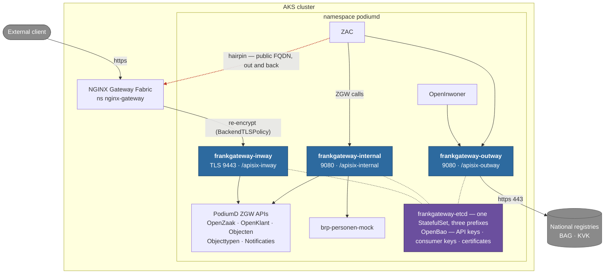

# Frank!Gateway — traffic classes (inway / outway / internal)

## Management summary

Frank!Gateway can run as one gateway handling every kind of API traffic, or as
three separate sets of pods — one for traffic coming into PodiumD, one for calls
going out to national registries, and one for applications talking to each
other. Splitting them means each kind of traffic can be secured, scaled and
monitored on its own, and a problem with one kind cannot take the other two
down. It also makes it possible, for the first time, to restrict what the
gateway is allowed to connect to: a single gateway needs permission to reach
everything at once, so no meaningful restriction is possible. The split is
optional and off by default — an existing municipality keeps exactly what it has
until it chooses to move.

## The three classes

| Instance | Traffic | Typical routes |
|----------|---------|----------------|
| `inway` | North-south, entering PodiumD | `inbound-<app>` — NGF terminates TLS, re-encrypts to the gateway, gateway forwards to the app Service |
| `outway` | PodiumD applications to external services | `apiproxy-bag`, `apiproxy-kvk-*` — the legacy api-proxy replacement |
| `internal` | East-west, application to application | `apiproxy-brp`, `internal-<app>` — replaces calls that would otherwise leave the cluster and come back |

## Architecture

Each traffic class gets its own gateway pods; the three share one etcd and are
kept apart by prefix.



The dotted red path is the **hairpin**: an in-cluster application calling
another one through its public hostname, so the request leaves the cluster,
crosses the load balancer and the ingress gateway, and comes back. Replacing it
with the `internal` instance is what removes that round trip.

## Why one etcd and three prefixes

APISIX in traditional mode loads exactly the objects stored beneath its
configured etcd prefix. Giving each instance its own prefix (`/apisix-inway`,
`/apisix-outway`, `/apisix-internal`) isolates routes, consumers and SSL objects
completely, without the cost of three etcd StatefulSets and three PVCs. etcd is
not the blast-radius concern — the gateway pods are.

## What the split buys

- **NetworkPolicies per class.** The real gain. One gateway carrying all three
  classes needs the union of their egress — the public internet, arbitrary
  in-cluster Services, and the backend Services — so nothing meaningful can be
  restricted. Separated, each class is held to its own:

  | Class | Ingress | Egress |
  |---|---|---|
  | `inway` | the ingress gateway namespace only | in-namespace backends + DNS |
  | `outway` | PodiumD app pods | DNS + `:443` to non-private addresses |
  | `internal` | PodiumD app pods | in-cluster only |

- **Independent scaling.** The outway is bursty against national registries; the
  internal instance is steady; the inway wants more than one replica because it
  is in the path of every inbound request.
- **Blast-radius isolation.** A bad route or plugin on one class cannot take the
  others down, and per-instance config checksums roll pods independently.
- **Clean per-class metrics**, one Service and ServiceMonitor per instance.

## Enabling the split

```yaml
frankgateway:
  enabled: true
  networkPolicies:
    enabled: true
  serviceAlias:            # keep the old `frankgateway` Service name working
    enabled: true          # while applications are repointed one at a time
    instance: outway
  instances:
    gateway:
      enabled: false       # the single-instance default is replaced
    inway:
      enabled: true
      replicas: 2
      tls:
        enabled: true
      dashboard:
        auth:
          hostname: frankgateway-inway-admin.<env>.<domain>
    outway:
      enabled: true
      dashboard:
        auth:
          hostname: frankgateway-outway-admin.<env>.<domain>
    internal:
      enabled: true
      dashboard:
        auth:
          hostname: frankgateway-internal-admin.<env>.<domain>
```

Anything not stated per instance is inherited from the shared `frankgateway`
block, so an instance only declares what differs.

### Migration order

1. Enable the split with `serviceAlias.enabled: true` pointing at `outway`.
   Every application still resolving `frankgateway:9080` keeps working.
2. Repoint applications one at a time to `frankgateway-outway:9080` (external
   API calls) or `frankgateway-internal:9080` (app-to-app).
3. Move inbound routing to `frankgateway-inway` (deploy-side: the ingress
   HTTPRoute backend and the re-encrypt policy).
4. Turn `serviceAlias` off once nothing resolves the bare name.

### Things that change name

Every instance-scoped object is suffixed. In particular the Admin API secret
becomes `frankgateway-<instance>-admin-credentials` — **deployment pipelines
that read `frankgateway-admin-credentials` by name must be updated**, which is
why `serviceAlias` exists and why the default instance keeps the old names.

## Footprint

Single instance: 4 pods (gateway, etcd, dashboard, oauth2-proxy + shim).
Full split with a dashboard per class: roughly 12 — three gateways, three
dashboards, three oauth2-proxy/shim pairs, one shared etcd. Drop
`dashboard.enabled` on the classes that do not need a GUI to bring that down;
the Admin API remains available to the routes hook Job either way.

## Related documents

- [`frankgateway-BASICS.md`](frankgateway-BASICS.md) — what Frank!Gateway is,
  its runtime components and required resources.
- [`frankgateway-split-exploration.md`](frankgateway-split-exploration.md) —
  the feasibility assessment this design came from.
- `files/frankgateway/routes/<class>/` (chart source) — the declarative route
  JSONs seeded per instance.
