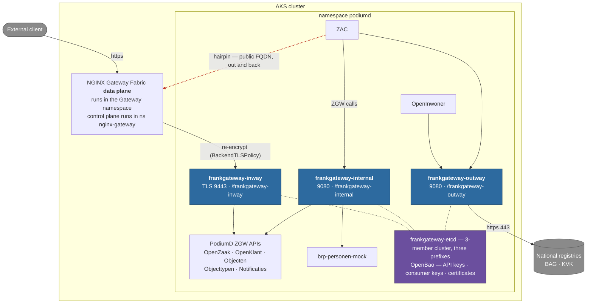

# Frank!Gateway — traffic classes (inway / outway / internal)

## Management summary

Frank!Gateway runs as three separate sets of pods — one for traffic coming into
PodiumD, one for calls going out to national registries, and one for
applications talking to each other. Keeping them apart means each kind of
traffic can be secured, scaled and monitored on its own, and a problem with one
kind cannot take the other two down. It also makes it possible to restrict what
the gateway is allowed to connect to: a single gateway handling everything needs
permission to reach everything at once, so no meaningful restriction is
possible. A municipality that has no use for one of the three can switch that
one off.

## The three classes

| Instance | Traffic | Typical routes |
|----------|---------|----------------|
| `inway` | North-south, entering PodiumD | `inbound-<app>` — NGF terminates TLS, re-encrypts to the gateway, gateway forwards to the app Service |
| `outway` | PodiumD applications to external services | `apiproxy-bag`, `apiproxy-kvk-*` — the legacy api-proxy replacement |
| `internal` | East-west, application to application | `apiproxy-brp`, `internal-<app>` — replaces calls that would otherwise leave the cluster and come back |

## Architecture

Each traffic class gets its own gateway pods (two of them); the three share one
3-member etcd cluster and are kept apart by prefix.



The dotted red path is the **hairpin**: an in-cluster application calling
another one through its public hostname, so the request leaves the cluster,
crosses the load balancer and the ingress gateway, and comes back. Replacing it
with the `internal` instance is what removes that round trip.

## Why one etcd and three prefixes

APISIX in traditional mode loads exactly the objects stored beneath its
configured etcd prefix. Giving each instance its own prefix (`/frankgateway-inway`,
`/frankgateway-outway`, `/frankgateway-internal`) isolates routes, consumers and SSL objects
completely, without the cost of three etcd clusters. The blast-radius concern
is the gateway pods, not the config store.

That store is still shared, so it is made to survive on its own terms: the one
StatefulSet runs **three members** (raft quorum two), spread across nodes, each
with its own PVC. Clients address the members individually rather than through
the load-balanced Service, so a client whose member dies fails over instead of
erroring. What remains shared is the *blast radius of a bad etcd*, not of a
dead pod: three classes still depend on one cluster, and a corrupted or full
etcd affects all of them.

## What the split buys

- **NetworkPolicies per class.** The real gain. One gateway carrying all three
  classes needs the union of their egress — the public internet, arbitrary
  in-cluster Services, and the backend Services — so nothing meaningful can be
  restricted. Separated, each class is held to its own:

  | Class | Ingress | Egress |
  |---|---|---|
  | `inway` | the ingress gateway namespace only | in-namespace backends + DNS |
  | `outway` | PodiumD app pods | DNS + `:443` to non-private addresses |
  | `internal` | PodiumD app pods | in-cluster only |

- **Independent scaling.** Every class starts at two replicas so nothing is one
  pod away from an outage, and each can then be scaled on its own evidence: the
  outway is bursty against national registries, the internal instance is
  steady, and the inway sits in the path of every inbound request.
- **Blast-radius isolation.** A bad route or plugin on one class cannot take the
  others down, and per-instance config checksums roll pods independently.
- **Clean per-class metrics**, one Service and ServiceMonitor per instance.

## Enabling the gateway

The three classes are the chart default: enabling Frank!Gateway enables all
three. There is no single-instance shape and no `gateway` key — a values file
still setting `frankgateway.instances.gateway` or `frankgateway.serviceAlias`
fails the render with a message naming this document.

**OpenBao is required alongside it.** External-API credentials are read from
OpenBao at request time and there is no second key path, so
`openbao.enabled: false` with `frankgateway.enabled: true` fails the render
rather than deploying a gateway that cannot authenticate to anything.

```yaml
frankgateway:
  enabled: true
  networkPolicies:
    enabled: true
    ingressNamespace: ingress-basic   # the NGF DATA plane namespace — see below
  instances:
    inway:
      replicas: 4                # 2 is the default; the inway carries every
                                 # inbound request, so it often wants more
      tls:
        enabled: true        # front door re-encrypts; see "Certificate on the
                             # internal hop" in frankgateway-BASICS.md for
                             # issuing and renewing it
      dashboard:
        auth:
          hostname: frankgateway-inway-admin.<env>.<domain>
    outway:
      dashboard:
        auth:
          hostname: frankgateway-outway-admin.<env>.<domain>
    internal:
      dashboard:
        auth:
          hostname: frankgateway-internal-admin.<env>.<domain>
```

Anything not stated per instance is inherited from the shared `frankgateway`
block, so an instance only declares what differs. A class an environment has no
use for is switched off with `enabled: false` — an environment making no calls
to national registries needs no outway.

Each dashboard needs its **own** hostname: they are separate Ingresses and
separate oauth2-proxy redirect URIs. Two instances claiming one hostname fails
the render rather than producing two Ingresses that fight over it.

### Turning dashboards on and off

Dashboards are meant to be switched on for debugging and testing and off the
rest of the time — they are the largest part of the footprint (six of the eight
pods per class, once everything runs at two replicas), and nothing else depends
on them. The route-seeding
Job talks to the Admin API directly, so a class with no dashboard is fully
managed and fully observable; you just have no GUI for it.

**All dashboards off** — one line in the shared block, inherited by every
instance:

```yaml
frankgateway:
  dashboard:
    enabled: false
```

**One dashboard on, the rest off** — the per-instance value wins over the
shared one, in either direction:

```yaml
frankgateway:
  dashboard:
    enabled: false          # fleet default: no GUI
  instances:
    inway:
      enabled: true
      dashboard:
        enabled: true       # ...except this one
        auth:
          hostname: frankgateway-inway-admin.<env>.<domain>
```

**A dashboard for debugging, with no hostname to arrange.** Turning SSO off
drops the oauth2-proxy and shim as well, so there is no ingress, no certificate
SAN and no Keycloak client to set up — which is usually what makes enabling a
dashboard mid-investigation annoying:

```yaml
frankgateway:
  instances:
    outway:
      dashboard:
        enabled: true
        auth:
          enabled: false
```

Then reach it locally:

```bash
kubectl -n <namespace> port-forward deploy/frankgateway-outway-dashboard 9000:9000
# http://localhost:9000 — log in with the instance's admin key:
kubectl -n <namespace> get secret frankgateway-outway-admin-credentials \
  -o jsonpath='{.data.admin}' | base64 -d; echo
```

**Do not leave `auth.enabled: false` on in a shared environment.** The
dashboard has no authentication of its own beyond the Admin API key, and
without oauth2-proxy in front there is nothing else stopping anyone in the
cluster reaching it. It is a debugging mode, not a configuration.

Turning a dashboard off removes its Deployments, Services, config Secret and its
Keycloak client, so no orphaned realm client is left behind and toggling it back
and forth is safe.

Two things it does not remove, neither harmful:

- the `frankgateway-dashboard-oidc-secret` key in the realm secret is always
  emitted, because the realm import Job references it unconditionally. With no
  dashboard it is simply unused. Per-instance keys
  (`frankgateway-dashboard-<class>-oidc-secret`) do disappear with their client.
- routing rows, DNS entries and certificate SANs created deploy-side for the
  hostname are outside the chart, so they persist until removed there.

| Setting | Renders | Needs a hostname |
|---|---|---|
| `dashboard.enabled: false` | nothing | no |
| `dashboard.enabled: true`, `auth.enabled: false` | dashboard only (port-forward) | no |
| `dashboard.enabled: true`, `auth.enabled: true` | dashboard + oauth2-proxy + shim + ingress | **yes** |

### Object names

Every instance-scoped object carries its class in the name. There is no
unsuffixed `frankgateway` object of any kind — no Service, no Secret, no
Deployment — so anything addressing the gateway must name the class it means:

| Object | Name |
|---|---|
| Service (data plane :9080, Admin API :9180) | `frankgateway-<class>` |
| Admin API credentials | `frankgateway-<class>-admin-credentials` |
| Gateway config (`config.yaml`) | `frankgateway-<class>-config` |
| Routes hook Job + ConfigMap | `frankgateway-<class>-apply-routes`, `-routes` |
| Dashboard chain | `frankgateway-<class>-dashboard`, `-shim`, `-oauth2-proxy` |
| Keycloak OIDC client | `frankgateway-dashboard-<class>` |
| etcd prefix | `/frankgateway-<class>` |

The shared etcd StatefulSet (`frankgateway-etcd`) is the one object that is not
per class.

**Deploy tooling reading any of these by name must name the class.** This is
the single most common way a change appears to work and does not — see the
jim00 lessons below.

### Lessons from the first environment to do this (jim00)

Recorded because each of these cost real debugging time and none is obvious
from the values file.

**Anything the deploy tooling does "to the gateway" must be done per
instance.** Four separate scripts assumed one gateway, and every failure
surfaced somewhere other than the change that caused it:

| Assumed one gateway | How it failed |
|---|---|
| Restarting `deploy/frankgateway` after a token rotation | other instances kept the old token until something unrelated restarted them |
| Registering the OpenBao secret backend | a secret backend is an etcd object, so it lives under one prefix; `$secret://` then fails **at request time as an auth rejection**, looking exactly like a wrong key |
| The OpenBao reader policy scoped to one secret path | a valid key is rejected with 401, indistinguishable from a wrong key |
| Seeding routes but not consumers | a `key-auth` route whose consumer does not exist yet rejects everything until the next run |

Select instances by `app.kubernetes.io/component=frankgateway` rather than
naming them, so a newly enabled class is covered without editing scripts.

**`networkPolicies.ingressNamespace` is the ingress DATA plane's namespace.**
For NGINX Gateway Fabric 2.x that is the Gateway's own namespace, not the
`nginx-gateway` namespace where the control plane runs. Only the control plane
carries the product name, which is what makes this easy to get wrong. It fails
closed with **no log line on either side**, because the packet never arrives —
so it presents as a TLS or connectivity fault rather than a policy one.

**Enabling `networkPolicies` is sticky.** Policies render for every classified
instance as soon as the flag is on, so enabling a *new* instance later ships a
policy with it in the same step. If the intent is to verify an instance first
and restrict it second, that has to be planned for.

**An ingress controller may not notice a retargeted `ExternalName`.** NGF kept
routing to the old target until its control plane was restarted. This matters
beyond migration: a rollback that relies on re-pointing an ExternalName can
appear to succeed while changing nothing.

**Deploy the instance before pointing traffic at it.** The reverse order leaves
a window where the ingress resolves a Service that does not exist yet.

### ZGW URL identity on the internal class

`pass_host: rewrite` with `upstream_host` set to the public hostname preserves
the **host** in the absolute URLs that ZGW APIs emit and consumers store. It
does **not** preserve the **scheme**: an application reached over plain http on
the internal class emits `http://` URLs where the same application reached
through the inway emits `https://`.

On `frank-gateway:104` (APISIX 3.16) this could not be fixed with headers —
`proxy-rewrite`, a function setting `ctx.var.var_x_forwarded_proto` in either
the `rewrite` or `before_proxy` phase, and a client-supplied
`X-Forwarded-Proto` were all discarded before reaching the upstream. The last
of those rules out plugin ordering as the explanation.

Since those URLs are stored, repointing an application first writes bad
references into data and the damage appears long after the change. Prefer
keeping the URL and changing what the hostname resolves to inside the cluster,
with the internal instance serving the existing certificate — then the scheme
is genuinely https and no application configuration changes. The trade-off is
that cluster DNS is cluster-wide, so the unit of migration becomes a hostname
rather than an application.

### The split is not a latency optimisation

Measured on jim00, in-cluster caller, 10 req/s per leg for 60s interleaved: the
"hairpin" (out through the public address and back in) cost **under 1ms** more
than the internal path at p50 and p95, and at p99 the internal path was
sometimes slower. That environment's public address resolves to a load balancer
in the same region, so the round trip never travels far.

Justify the split on traffic classification, egress restriction and blast
radius. Measure before claiming a latency benefit anywhere else.

## Footprint

Everything runs at **two replicas**, and etcd at **three**, so that no single
pod event — crash, eviction, node image upgrade, autoscaler consolidation —
takes anything down. That sets the floor:

| | Pods |
|---|---|
| Three gateways | 6 |
| etcd | 3 |
| Three dashboards | 6 |
| Three oauth2-proxy + shim pairs | 12 |
| **Total, everything on** | **27** |
| **Dashboards off on every class** | **9** |

Dashboards are two thirds of it, and nothing depends on them: the routes hook
Job talks to the Admin API directly. `dashboard.enabled: false` on the classes
that need no GUI is the one big lever.

etcd is three because it is raft — quorum of three is two, so it survives
losing one member. **Two would be worse than one**: quorum of two is also two,
so any single loss stops writes.

Every workload also carries a **PodDisruptionBudget** of `maxUnavailable: 1`
(`frankgateway.podDisruptionBudget`, and `etcd.podDisruptionBudget` for the
store). Replicas alone survive a pod crash; they survive a `kubectl drain`, an
AKS node image upgrade or an autoscaler consolidation only because the budget
forbids evicting them all at once. `maxUnavailable` rather than `minAvailable`
so the guarantee does not weaken as a class is scaled up — `minAvailable: 1` on
four replicas would permit three simultaneous evictions. Budgets carry
`unhealthyPodEvictionPolicy: AlwaysAllow`, so an already-broken pod can still be
evicted and never makes a node undrainable.

Replicas are held on separate nodes as a **hard** requirement
(`whenUnsatisfiable: DoNotSchedule`), so the cluster needs at least two
schedulable nodes for the gateways and three for etcd. A replica that cannot
get its own node stays **Pending** — deliberately: that is visible, whereas two
replicas quietly sharing a node is a deployment that looks highly available and
is not. With the autoscaler enabled the Pending pod is what triggers a new
node. Override per instance with `topologySpreadConstraints` if an environment
genuinely needs the looser behaviour.

## Related documents

- [`frankgateway-BASICS.md`](frankgateway-BASICS.md) — what Frank!Gateway is,
  its runtime components and required resources.
- [`frankgateway-split-exploration.md`](frankgateway-split-exploration.md) —
  the feasibility assessment this design came from.
- `files/frankgateway/routes/<class>/` (chart source) — the declarative route
  JSONs seeded per instance.
