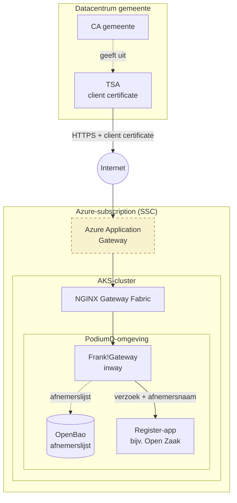
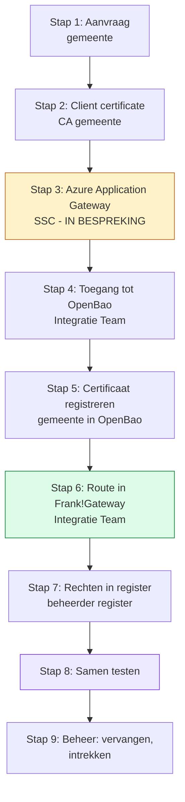
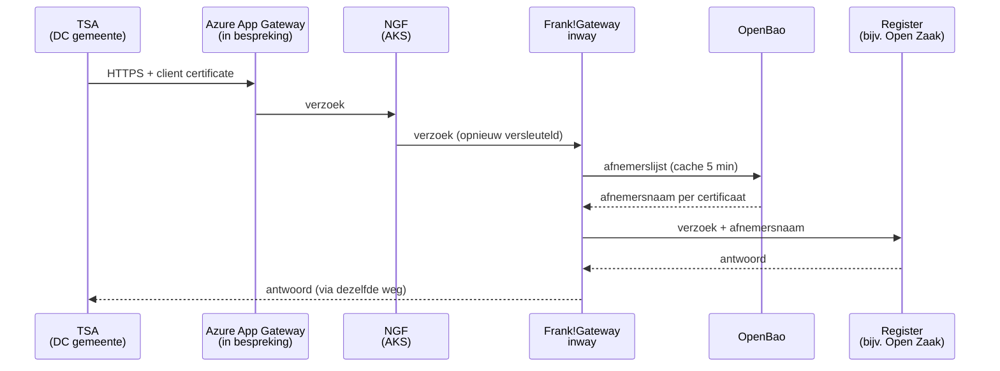
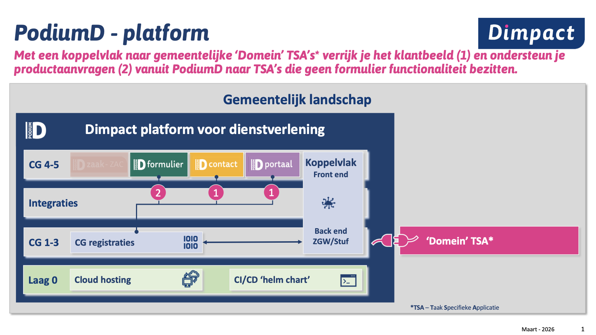
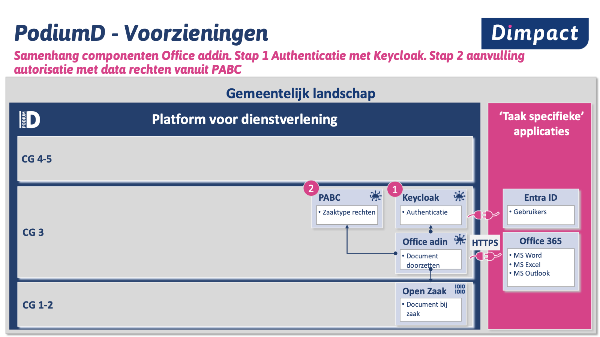
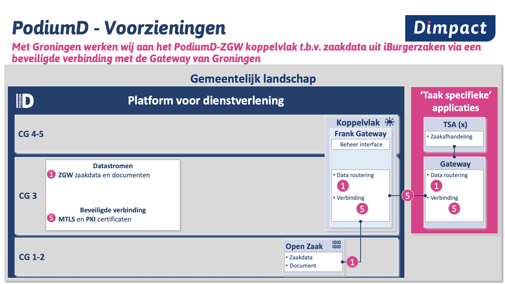
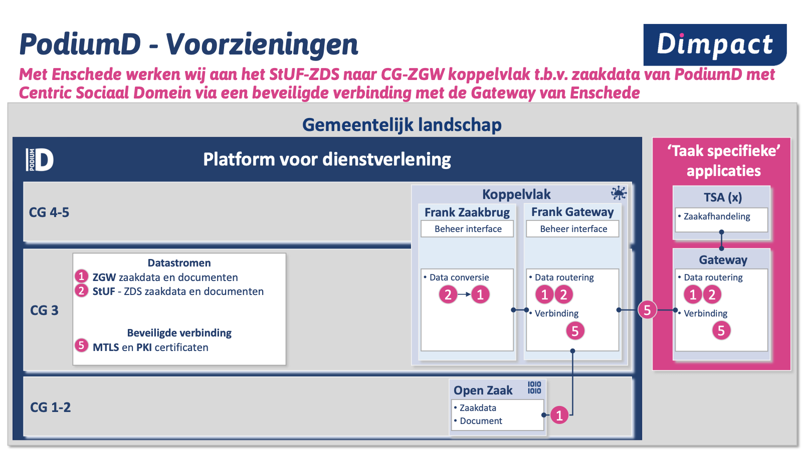
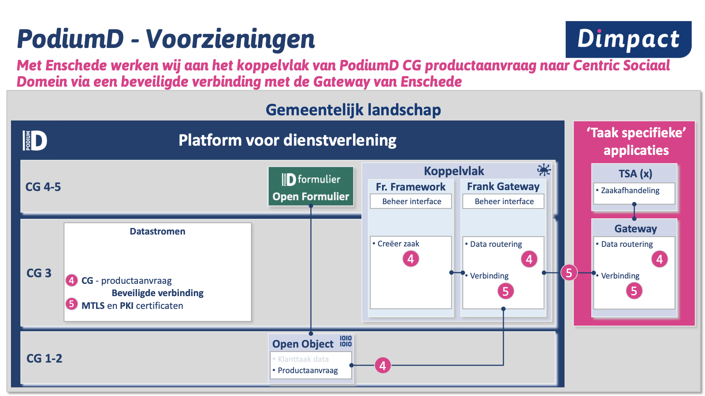
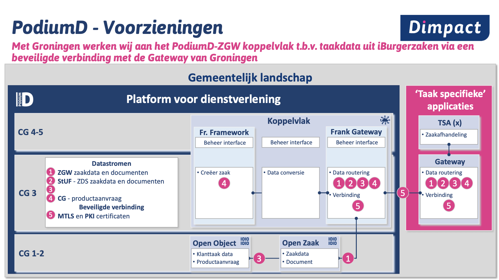

# Gemeente TSA - Frank!Gateway - Setup en Flow

Versie 1.0. Geconverteerd uit
`Gemeente TSA - Frank!Gateway - Setup en Flow v1.0.docx`.

## Executive Summary

Een taakspecifieke applicatie (TSA) in het datacentrum van een gemeente kan via
internet of Diginetwerk de register-API's van de eigen PodiumD-omgeving in Azure
aanroepen. Frank!Gateway is daarbij de toegangspoort: alleen een bekende,
toegestane afnemer komt door.

- **Identiteit**: de TSA meldt zich met een client certificate, uitgegeven door
  de eigen gemeentelijke CA
- **Registratie**: de gemeente registreert dat certificaat voor client
  certificate authenticatie onder een afnemersnaam in OpenBao, via de
  webinterface met inlog voor beheerders via Keycloak.
- **Toegang per API**: per register-API legt een Frank!Gateway-route vast welke
  afnemers erdoor mogen.
- **Doorgifte**: na goedkeuring stuurt Frank!Gateway het verzoek door naar het
  register, dat daarna nog zijn eigen autorisatie toepast.

De rol van de Azure Application Gateway (AAG) aan de voorkant is nog **in
bespreking**. De stappen daarvoor staan hieronder op hun plek, maar zijn bewust
leeg gelaten. De rest van de keten is werkend aangetoond op een testomgeving,
nog niet bij een gemeente in productie.

## Betrokken partijen

Zes partijen hebben een rol; de gemeente doet het meeste werk zelf, het
Integratie Team legt de routes vast.

| Partij | Rol in dit proces |
|----|----|
| Gemeente - applicatiebeheer TSA | Vraagt toegang aan, installeert het client certificate in de TSA, registreert het in OpenBao |
| Gemeente - PKI/CA-beheer | Geeft het client certificate uit vanuit de eigen CA en levert de gegevens voor client certificate authenticatie |
| Integratie Team | Keycloak-toegang tot OpenBao, Frank!Gateway-routes, deploy van de omgeving |
| Team Leveren (Dimpact) | Aanspreekpunt voor gemeentes: verzorgt de communicatie en helpt bij de inrichting. Precieze rol **in bespreking** |
| SSC (hosting) | Azure-omgeving en de Azure Application Gateway - rol **in bespreking** |
| Beheerder register-API | Geeft de TSA eigen API-rechten in het register (bijv. Open Zaak) |

## Componenten

Zes componenten, plus optioneel Diginetwerk, vormen de keten van TSA tot
register

| Component | Rol in de keten | Waar |
|----|----|----|
| TSA (taakspecifieke applicatie) | De afnemer: roept de register-API aan met een client certificate en een eigen API-token voor het register | Datacentrum van de gemeente |
| Diginetwerk (optioneel) | Besloten netwerk van de overheid (Logius): optionele route van de TSA naar de PodiumD-omgeving in plaats van via het open internet. De client certificate authenticatie en de rest van de keten blijven gelijk. | Tussen datacentrum gemeente en Azure |
| Register-applicatie (bijv. Open Zaak) | Levert de gegevens; past na doorgifte zijn eigen autorisatie toe op het API-token van de TSA | PodiumD-omgeving (AKS) |
| Azure Application Gateway (AAG) | Voorkant vanaf internet; rol bij vertrouwen van de gemeentelijke CA en certificaatcontrole is *in bespreking* | Azure, beheerd door SSC |
| NGINX Gateway Fabric (NGF) | Platform-gateway in het Kubernetes-cluster: neemt het verzoek aan en stuurt het opnieuw versleuteld door naar Frank!Gateway | AKS-cluster |
| Frank!Gateway (inway) | Toegangspoort: kiest de route, herkent de afnemer via client certificate authenticatie, controleert de `allow`-lijst en stuurt door naar het register | AKS-cluster |
| OpenBao | Bewaart de afnemerslijst (`frankgateway/consumers`); de gemeente beheert haar regels via de webinterface met Keycloak-inlog | PodiumD-omgeving |

### Plaatsing van de componenten

De TSA en de CA staan in het datacentrum van de gemeente. Alles vanaf de AAG
draait in de Azure-subscription; NGF, Frank!Gateway, OpenBao en het register
staan binnen het AKS-cluster.

## Inrichting (onboarding)

Negen stappen brengen een nieuwe TSA van aanvraag naar een werkende verbinding.
Een nieuw certificaat registreren vraagt geen deploy; een nieuwe route of een
nieuwe afnemer op een route wel.

De stappen volgen de volgorde van het schema; stap 3 wacht op de uitkomst van
het overleg over de AAG.

1. **Aanvraag** - *gemeente*
   - De gemeente meldt de TSA aan bij het Integratie Team: welke applicatie,
     welke register-API('s), en een afnemersnaam (bijv. `zaaksysteem-x`).
   - Resultaat: afspraak over naam en scope.
2. **Client certificate uitgeven** - *gemeente, PKI/CA-beheer*
   - De eigen CA van de gemeente geeft een client certificate uit voor de TSA.
     De private key blijft in het datacentrum van de gemeente.
   - De gemeente levert de gegevens voor client certificate authenticatie aan
     (die gebruikt stap 5).
   - Resultaat: certificaat geïnstalleerd in de TSA, klaar voor client
     certificate authenticatie.
3. **Azure Application Gateway inrichten** - *In bespreking*
   - *Nog in bespreking; wordt aangevuld zodra het ontwerp vaststaat.*
4. **Toegang tot OpenBao** - *Integratie Team*
   - De beheerder van de gemeente krijgt in Keycloak de groep
     `vault-uploaders`. Daarmee kan die inloggen op de OpenBao-webinterface van
     de eigen PodiumD-omgeving.
   - Resultaat: de gemeente kan zelf afnemers registreren.
5. **Certificaat registreren in OpenBao** - *gemeente*
   - De beheerder logt in op de OpenBao-webinterface (via Keycloak) en voegt in
     de afnemerslijst `frankgateway/consumers` een regel toe voor client
     certificate authenticatie: afnemersnaam = SHA-1-vingerafdruk van het
     certificaat (bij vervanging van het certificaat tijdelijk twee,
     komma-gescheiden; zie [routes → consumer identities](frankgateway-routes.md#consumer-identities-from-openbao-inbound)).
   - Actief binnen 5 minuten, zonder deploy.
   - *Let op: via de webinterface is dit nog niet in de praktijk beproefd; tot
     nu toe gebeurde het via de command line.*
6. **Route in Frank!Gateway** - *Integratie Team*
   - Per register-API komt er een route in de inway van Frank!Gateway. Die legt
     vast: het adres (bijv. `/openzaak/...`), dat de afnemerscontrole geldt,
     welke afnemers mogen (de `allow`-lijst) en naar welk register het verzoek
     gaat.
   - De route staat in de configuratie van de omgeving en gaat live met een
     deploy via de Azure DevOps-pipeline.
   - Resultaat: de TSA heeft een pad naar het register.
7. **Rechten in het register** - *beheerder register-API*
   - Het register houdt zijn eigen autorisatie. Voor Open Zaak krijgt de TSA een
     eigen ZGW-client in Autorisaties en stuurt zelf een JWT mee.
8. **Samen testen** - *gemeente en Integratie Team*
   - Een toegestane aanroep geeft 200; een onbekend certificaat geeft 401; een
     bekende afnemer zonder toegang tot die route geeft 403.
   - Testgevallen aan de kant van de AAG: *In bespreking*.
9. **Beheer daarna** - *gemeente, Integratie Team*
   - **Certificaat vervangen**: tijdelijk beide certificaten registreren voor
     client certificate authenticatie (oud en nieuw), na de wissel alleen de
     nieuwe.
   - **Afnemer stoppen**: de regel uit de afnemerslijst halen; binnen 5 minuten
     geldt dat.
   - **Certificaat intrekken**: het certificaat uit de afnemerslijst halen.
     Intrekken aan de kant van de AAG: *In bespreking*.

## Verloop van een verbinding

Een aanroep van de TSA naar bijvoorbeeld Open Zaak passeert vier schakels
voordat het register antwoordt. Frank!Gateway beslist of de afnemer door mag;
het register beslist daarna wat de afnemer mag.

1. **Verzoek vanuit de TSA** - De TSA in het datacentrum van de gemeente opent
   via internet een HTTPS-verbinding naar het adres van de PodiumD-omgeving en
   toont daarbij haar client certificate. Ze stuurt ook haar eigen API-token
   voor het register mee (voor Open Zaak een ZGW-JWT).
2. **Azure Application Gateway** - *In bespreking.*
3. **Platform-gateway in AKS** - De platform-gateway (NGINX Gateway Fabric) in
   het Kubernetes-cluster neemt het verzoek aan en stuurt het, opnieuw
   versleuteld, door naar de inway van Frank!Gateway.
4. **Route kiezen** - Frank!Gateway kiest aan de hand van het adres (bijv.
   `/openzaak/...`) de route, en daarmee het register en de lijst toegestane
   afnemers.
5. **Afnemer herkennen** - Frank!Gateway zoekt het client certificate op in de
   afnemerslijst in OpenBao. De lijst wordt 5 minuten bewaard; is OpenBao
   onbereikbaar, dan werkt Frank!Gateway tot een uur verder met de laatst
   bekende lijst. Hoe de client certificate authenticatie Frank!Gateway
   bereikt, hangt af van de AAG en is *in bespreking*.
6. **Toegang controleren** - Onbekend client certificate: geweigerd (401).
   Bekende afnemer die niet op de lijst van deze route staat: geweigerd (403).
7. **Doorsturen** - Frank!Gateway zet de afnemersnaam in het verzoek
   (`X-Consumer-Username`), haalt het voorvoegsel `/openzaak` van het adres en
   stuurt het verzoek door naar het register.
8. **Register** - Het register controleert zijn eigen autorisatie (het
   API-token van de TSA), voert de aanroep uit en antwoordt.
9. **Antwoord** - Het antwoord gaat langs dezelfde weg terug naar de TSA.

### Mogelijke uitkomsten

| Situatie | Antwoord | Waar geweigerd |
|----|----|----|
| Toegestane afnemer, geldig API-token | 200 - antwoord van het register | - |
| Geen client certificate | *In bespreking* | Azure Application Gateway |
| Certificaat van een niet-vertrouwde CA | *In bespreking* | Azure Application Gateway |
| Geldig certificaat, niet geregistreerd voor client certificate authenticatie | 401 | Frank!Gateway |
| Certificaatcontrole niet bevestigd door de voorkant | 401 | Frank!Gateway |
| Bekende afnemer, niet toegestaan op deze route | 403 | Frank!Gateway |
| Afnemer toegelaten, maar geen of ongeldig API-token | 401 of 403 | Register |

## Appendix: relevante slides uit PodiumD-presentatie

Bron: PodiumD-presentatie, Wiebe Kortenbach, maart 2026.

