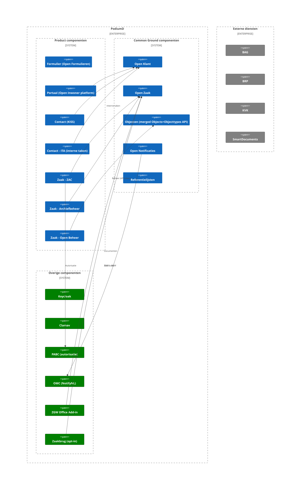

# Overzicht van het PodiumD platform

## Achtergrond

PodiumD is opgezet door Dimpact als een platform van applicaties voor gemeentelijke dienstverlening.

## Architectuur

Hieronder staat het System Context diagram van PodiumD, dat de architectuur van het PodiumD systeem weergeeft. 
Het diagram toont de interacties tussen de verschillende componenten, zowel binnen als buiten de PodiumD context.

> Diagram bijgewerkt voor PodiumD **4.8.0**: PABC (autorisatie, standaard aan
> sinds 4.8.0), ITA, Open Beheer, OMC (NotifyNL), Referentielijsten,
> ZGW Office Add-in en Zaakbrug (opt-in) toegevoegd.

## Componenten

### Formulier (Open Formulieren)
Zie voor architectuur context diagram van Open Formulieren de [Open Formulieren documentatie](./formulieren.md).

### Contact (KISS)
Zie voor architectuur context diagram van Contact (KISS) de [Contact documentatie](./contact.md).

## Operationele functionaliteit

### MI exports — wekelijkse database dumps naar SFTP
Wekelijkse exports van alle Postgres-componenten naar een externe SFTP server (CSV of `pg_dump`), per gemeente.
Voor activatie, infra-prerequisites (incl. Terraform-snippet voor externe hosting), en troubleshooting:
zie [MI exports documentatie](../misc/mi-exports.md).
