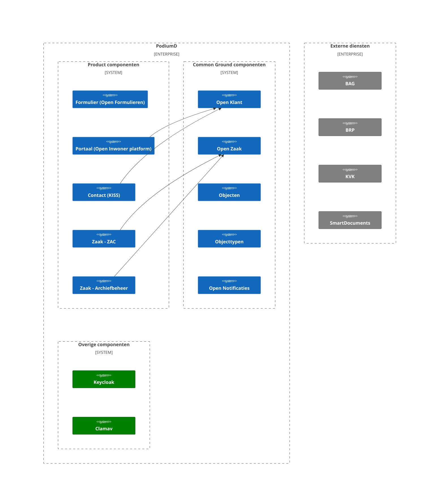

# Overzicht van het PodiumD platform

## Achtergrond

PodiumD is opgezet door Dimpact als een platform van applicaties voor gemeentelijke dienstverlening.

## Architectuur

Hieronder staat het System Context diagram van PodiumD, dat de architectuur van het PodiumD systeem weergeeft. 
Het diagram toont de interacties tussen de verschillende componenten, zowel binnen als buiten de PodiumD context.

## Componenten

### Formulier (Open Formulieren)
Zie voor architectuur context diagram van Open Formulieren de [Open Formulieren documentatie](./formulieren.md).
