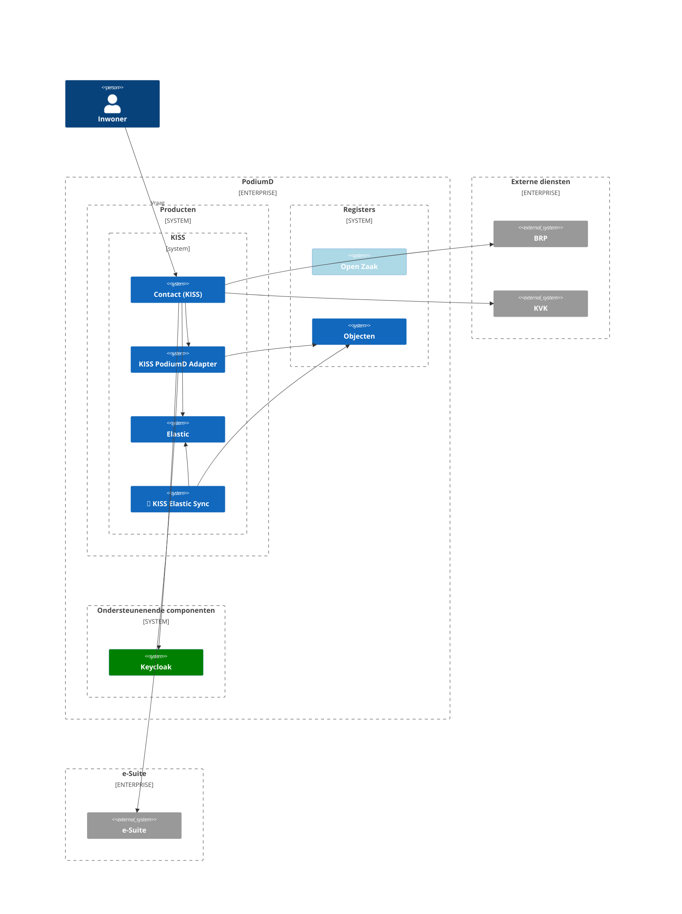

# Contact (KISS)

## Architectuur context binnen PodiumD

```mermaid

C4Context

    Person(Citizen, "Inwoner")

    Enterprise_Boundary(b0, "PodiumD") {
        System_Boundary(products, "Producten") {
            Boundary(kiss, "KISS") {
                System(Contact,"Contact (KISS)")
                System(kpa, "KISS PodiumD Adapter")
                System(elastic, "Elastic")
                System(esync, "🔄 KISS Elastic Sync")
            }
        }

        System_Boundary(registers, "Registers") {
            System(OpenZaak, "Open Zaak")
            System(Objecten, "Objecten")
        }

        System_Boundary(andersteunend, "Ondersteunenende componenten") {
            System(keycloak, "Keycloak")
        }
    }

    Enterprise_Boundary(ext, "Externe diensten") {
        System_Ext(BRP, "BRP")
        System_Ext(KVK, "KVK")
    }

    Enterprise_Boundary(b1, "e-Suite") {
        System_Ext(esuite, "e-Suite")
    }

    Rel(Citizen, Contact, "Vraag")
    Rel(Contact, kpa, "")
    Rel(Contact, elastic, "")
    Rel(Contact, keycloak, "")
    Rel(Contact, BRP, "")
    Rel(Contact, KVK, "")

    Rel(kpa, Objecten, "")
    Rel(kpa, esuite, "")

    Rel(esync, elastic, "")
    Rel(esync, Objecten, "")

    UpdateElementStyle(keycloak, $bgColor="green")
    UpdateElementStyle(OpenZaak, $bgColor="lightblue")

    UpdateLayoutConfig($c4ShapeInRow="4", $c4BoundaryInRow="2")

```
