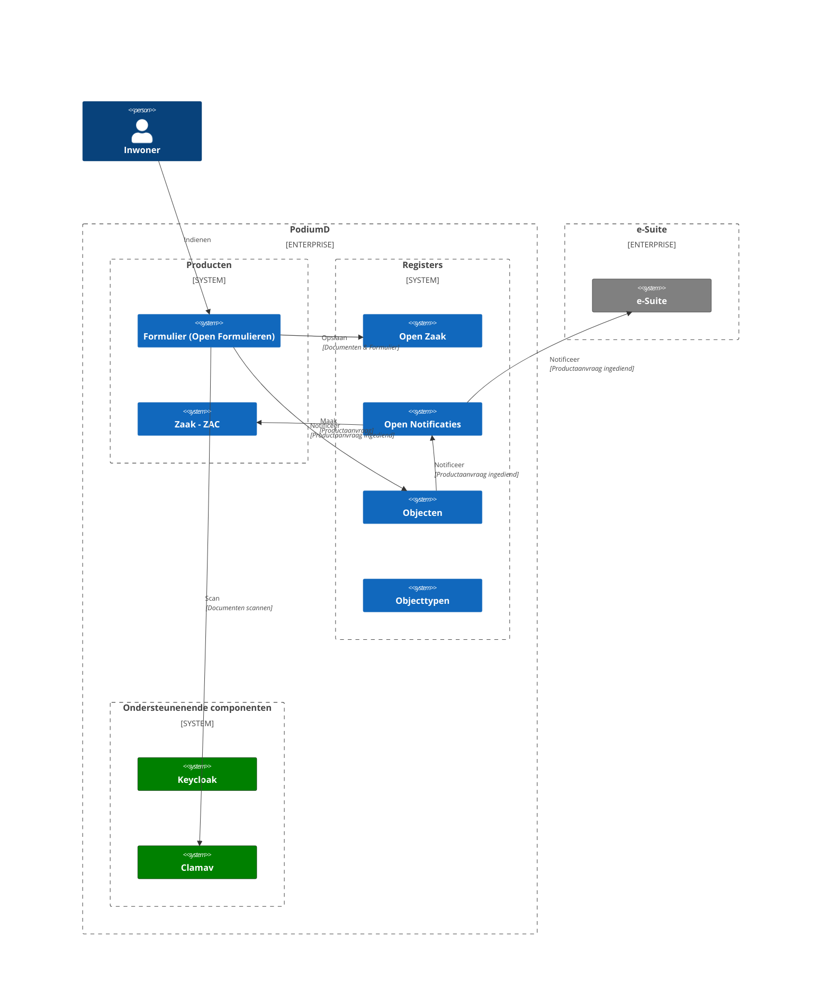

# Formulier (Open Formulieren)

## Architectuur context binnen PodiumD

```mermaid
C4Context

    Person(Citizen, "Inwoner")

    Enterprise_Boundary(b0, "PodiumD") {
        System_Boundary(products, "Producten") {
            System(OpenFormulieren, "Formulier (Open Formulieren)")
            System(ZAC, "Zaak - ZAC")
        }

        System_Boundary(registers, "Registers") {
            System(OpenZaak, "Open Zaak")
            System(OpenNotificaties, "Open Notificaties")
            System(Objecten, "Objecten")
            System(Objecttypen, "Objecttypen")
        }

        System_Boundary(andersteunend, "Ondersteunenende componenten") {
            System(keycloak, "Keycloak")
            System(clamav, "Clamav")
        }
    }

    Enterprise_Boundary(b1, "e-Suite") {
        System(esuite, "e-Suite")
    }

    Rel(Citizen, OpenFormulieren, "Indienen")
    Rel(OpenFormulieren, clamav, "Scan", "Documenten scannen")
    Rel(OpenFormulieren, OpenZaak, "Opslaan", "Documenten & Formulier")
    Rel(OpenFormulieren, Objecten, "Maak", "Productaanvraag")
    Rel(Objecten, OpenNotificaties, "Notificeer", "Productaanvraag ingediend")
    Rel(OpenNotificaties, ZAC, "Notificeer", "Productaanvraag ingediend")
    Rel(OpenNotificaties, esuite, "Notificeer", "Productaanvraag ingediend")

    UpdateElementStyle(keycloak, $bgColor="green", $borderColor="black")
    UpdateElementStyle(clamav, $bgColor="green", $borderColor="black")
    UpdateElementStyle(esuite, $bgColor="grey", $borderColor="black")
```
